# Capstone Documentation Diagrams

Based on your requested sections, here is an analysis of which sections benefit most from visual figures, along with the corresponding Mermaid diagrams ready to be embedded into your documentation.

## 2.3 Agile Scrum Methodology
**Requires a diagram:** Yes. Scrum is highly procedural and is best explained visually.

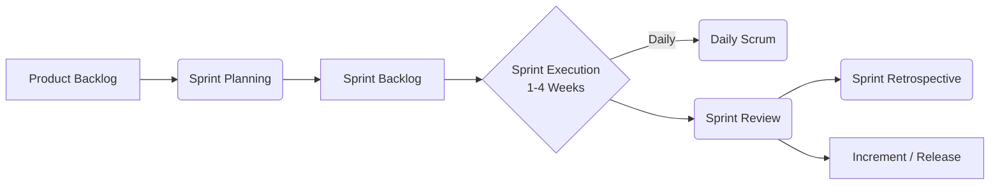

## 2.4.1 Microservices Architecture
**Requires a diagram:** Yes. A comparison between a monolithic approach and microservices helps define the concept.

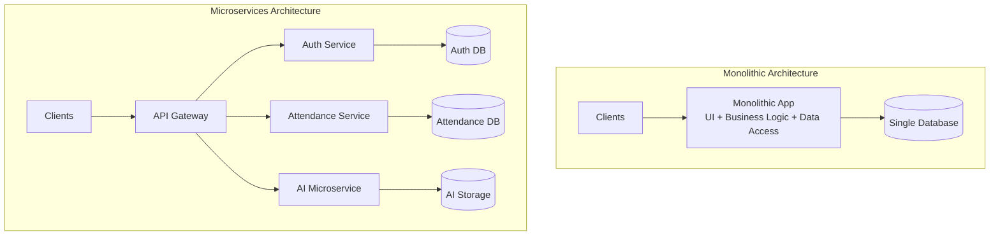

## 2.4.2 Artificial Intelligence (AI)
**Requires a diagram:** Yes. Specifically, demonstrating the AI pipeline for your application (e.g., Facial Recognition).

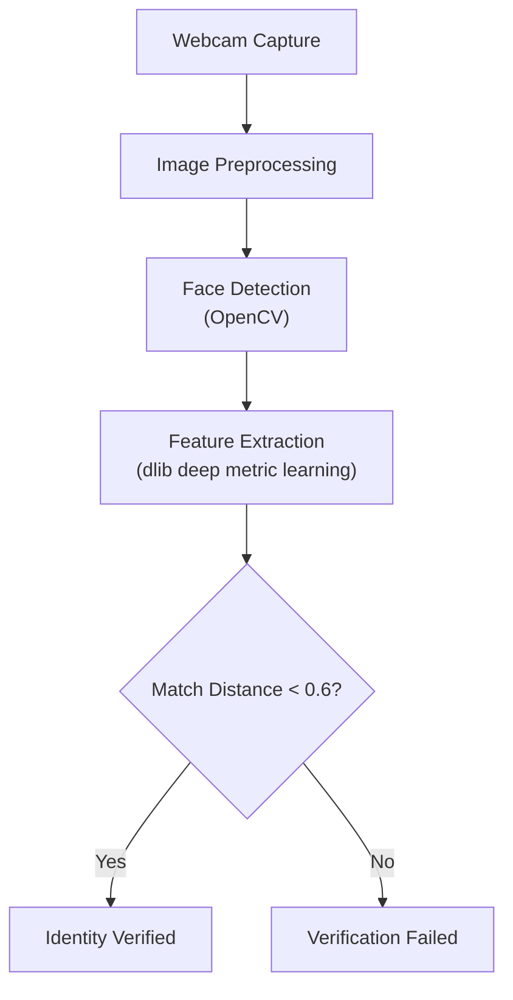

## 2.4.5 Polyglot Persistence
**Requires a diagram:** Yes. Shows how different technologies use the right database for the right job.

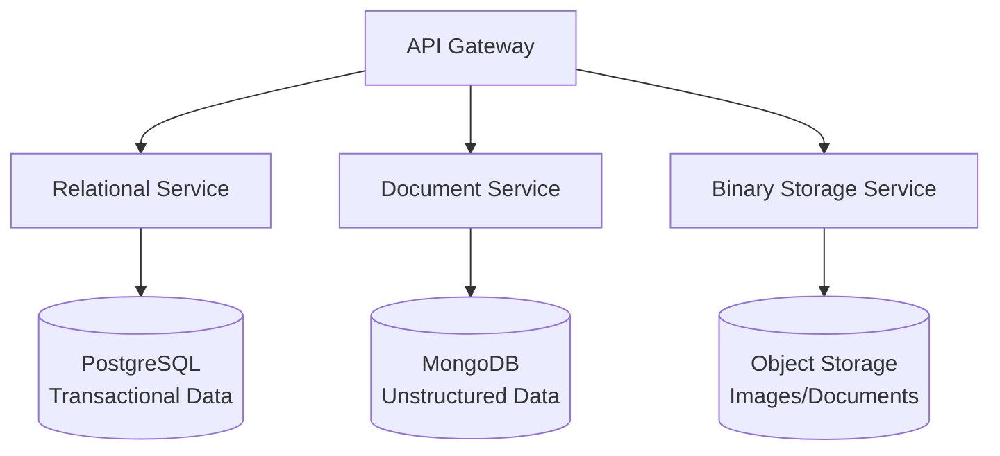

## 2.5 DevOps Culture and CI/CD Practices
**Requires a diagram:** Yes. A standard continuous integration and continuous deployment pipeline is essential for this section.

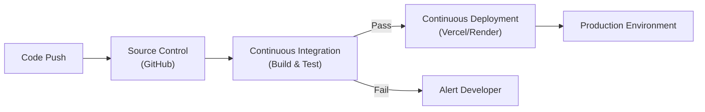

## 2.6 Enterprise Architecture & System Integration
**Requires a diagram:** Yes. Shows how the different large-scale components (Frontend, BaaS, AI Backend) communicate.

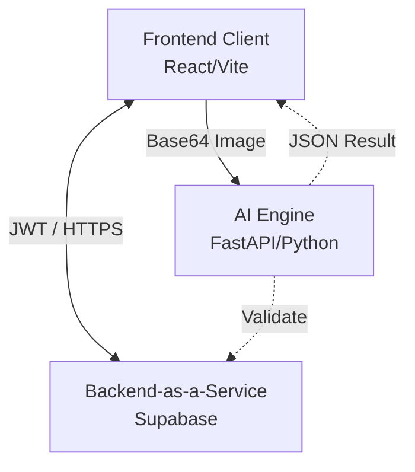

## 2.6.1 System Communication Patterns
**Requires a diagram:** Yes. Illustrates the synchronous (REST/HTTPS), asynchronous (WebSockets/Realtime), event-driven (Database Triggers/CDC), and AI microservice communication patterns across the platform.

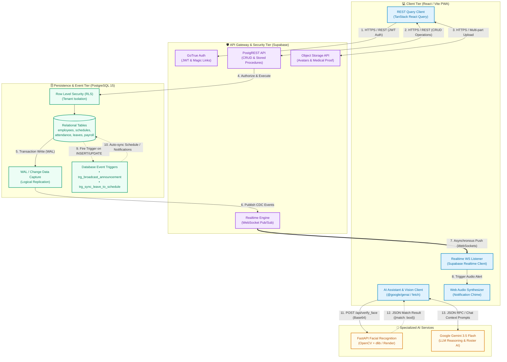

### Communication Patterns Matrix

| Pattern Type | Communication Style | Protocol / Transport | Source Component | Target Component | Purpose & Use Case |
| :--- | :--- | :--- | :--- | :--- | :--- |
| **Request-Response (CRUD)** | Synchronous | HTTPS / REST (JSON) | React UI (`TanStack Query`) | Supabase PostgREST | Querying and mutating employees, schedules, timesheets, and payslips. |
| **Authentication & Session** | Synchronous | HTTPS / REST (JWT) | React UI (`Supabase Auth`) | GoTrue Auth Server | Magic Link verification, login tokens, and role-based access control. |
| **Biometric Face Verification** | Synchronous | HTTPS / REST (JSON/Base64) | React UI (Webcam Capture) | FastAPI AI Microservice | Real-time 128D facial landmark extraction and Euclidean distance matching. |
| **Generative HR Intelligence** | Synchronous | HTTPS / REST (JSON) | React UI / Embedded Assistant | Google Gemini 3.5 API | Natural language querying, leave evaluation, and schedule health audits. |
| **Change Data Capture (CDC)** | Asynchronous | Logical Replication (WAL) | PostgreSQL Engine | Supabase Realtime Server | Streaming database table changes (`INSERT`/`UPDATE`) to the broker. |
| **Live Notifications & Radar** | Asynchronous (Push) | WebSockets (`wss://`) | Supabase Realtime Server | React UI (`useNotifications`) | Instant notification delivery, bell animation, and live radar map updates. |
| **Database Event Triggers** | Event-Driven | PostgreSQL Internal Bus | DB Table Event | PL/pgSQL Stored Triggers | Auto-broadcasting announcements and syncing approved leaves to schedules. |
| **Binary Document Uploads** | Synchronous | HTTPS / Multipart | React UI | Supabase Storage Bucket | Storing medical certificates, avatars, and official 201 compliance attachments. |

## 2.7 Conceptual Framework
**Requires a diagram:** Yes. Academic and capstone papers almost always require an Input-Process-Output (IPO) diagram for the conceptual framework.

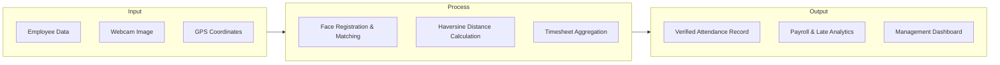

## 2.8 Theoretical Paradigm
**Requires a diagram:** Yes. Often involves adopting a well-known model like the Technology Acceptance Model (TAM) or DeLone and McLean IS Success Model. Here is a TAM diagram.

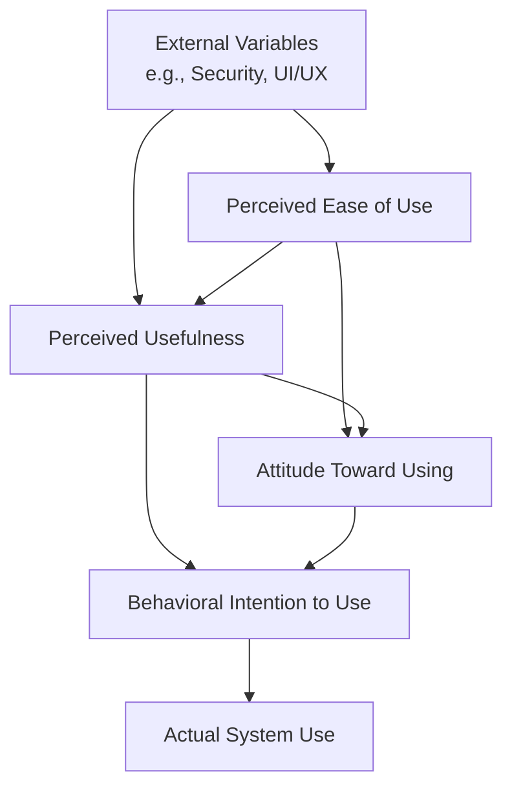

---
### Additional Requested Sections

Here are the diagrams for the remaining sections you requested:

## 2.4 Emerging Technologies (Intro)
This diagram illustrates the convergence of modern technologies into a single intelligent system.

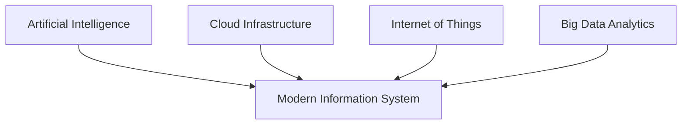

## 2.4.3 Internet of Things (IoT)
Illustrates how physical edge devices (like cameras and GPS modules) transmit data to the cloud.

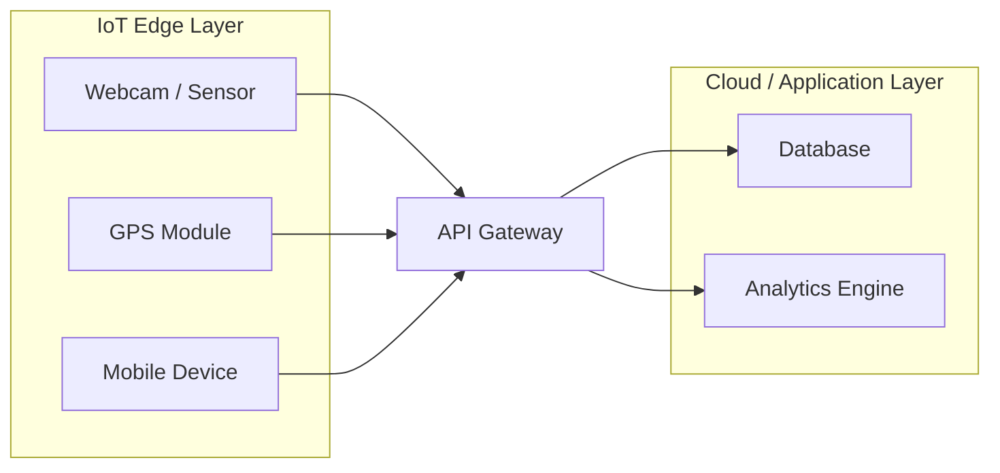

## 2.4.4 Data Analytics and Business Intelligence
Shows the data pipeline from raw data generation to business intelligence insights.

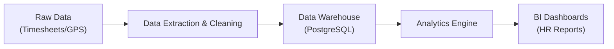

## 2.4.8 Software Quality Standards
The classic Software Testing Pyramid, demonstrating standard quality assurance practices.

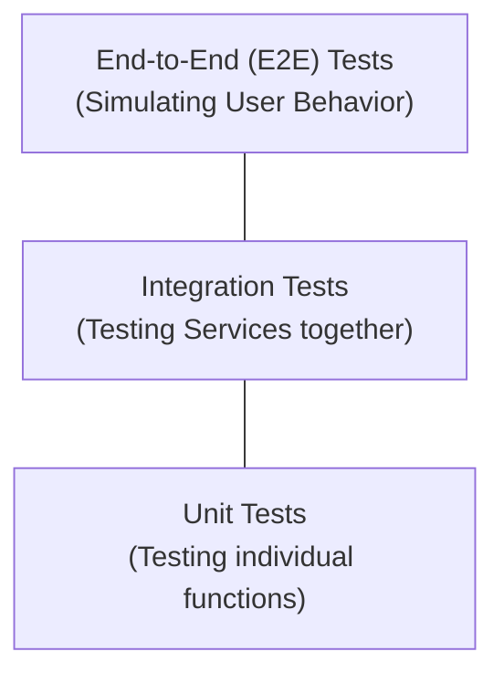

## 2.4.9 Cloud Computing
A breakdown of the standard Cloud Computing service models (IaaS, PaaS, SaaS).

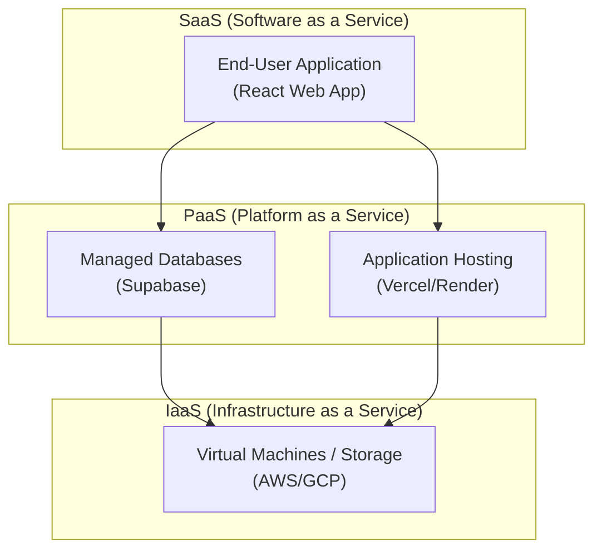

## 2.4.10 Edge Computing
Shows the difference between sending heavy processing to the cloud versus processing it locally on the "Edge" (the user's device).

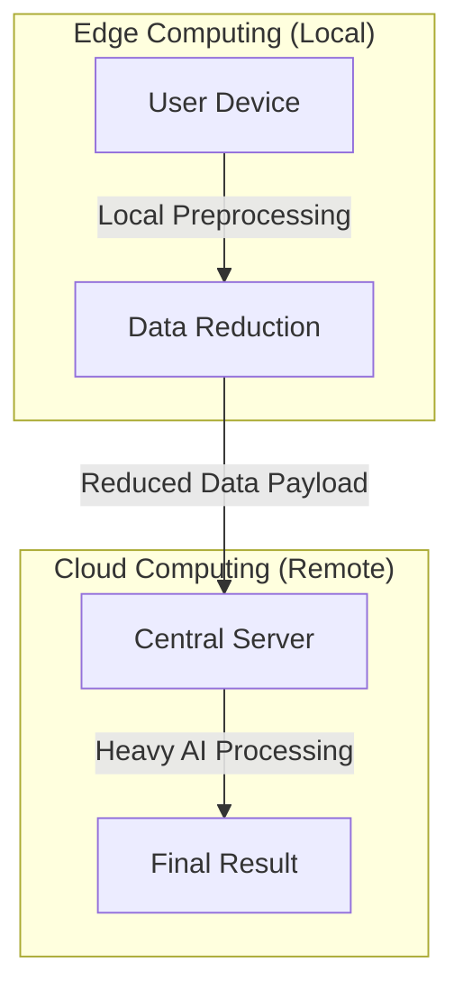

---

## 3.x Data Flow Diagrams (DFD)
For the full multi-level Data Flow Diagrams and Data Dictionary, see [data_flow_diagram.md](file:///c:/Users/Nico/Workforce-ManagementPro-main/Documentation/data_flow_diagram.md).

### Context Diagram (Level 0 DFD)
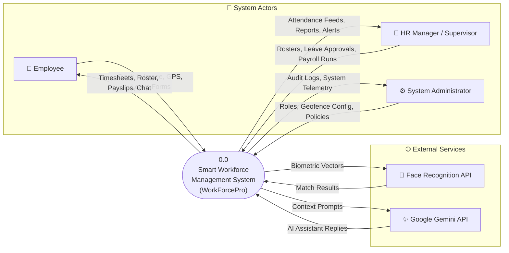

