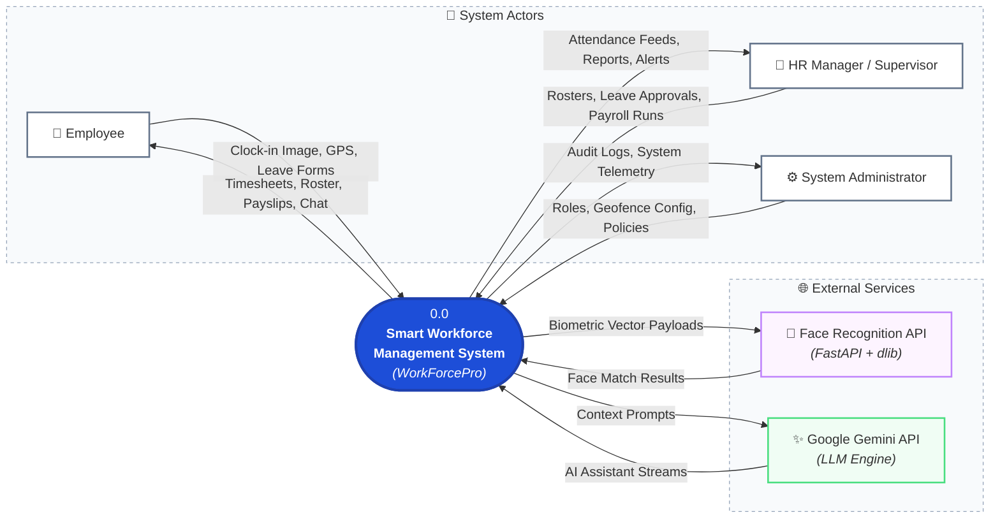
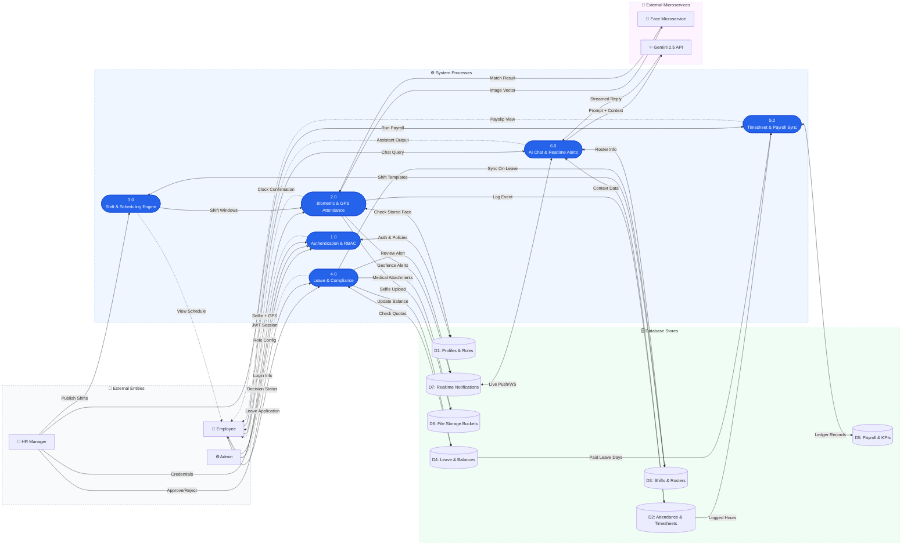
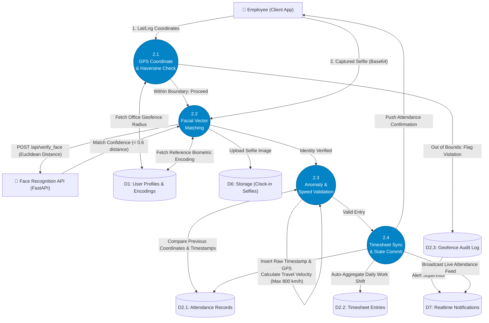
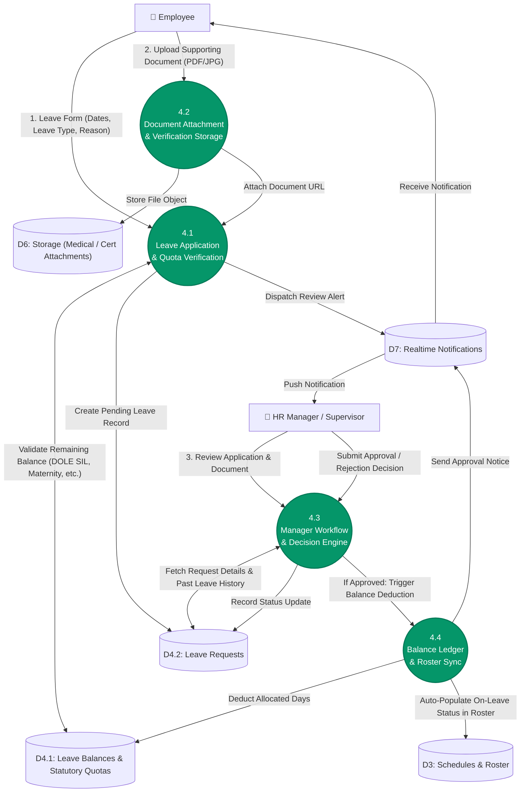

# Data Flow Diagrams (DFD)
**Project: Smart Workforce Management System (WorkForcePro)**

This document presents the complete Data Flow Diagram (DFD) specifications for the **Smart Workforce Management System**. It follows standard structured systems analysis principles (Gane & Sarson / Yourdon notations mapped to clean Mermaid specifications) suitable for Capstone Documentation (Chapter 3: System Design & Analysis).

---

## 1. DFD Conventions & Symbol Legend

| Element | Description | Mermaid Representation |
| :--- | :--- | :--- |
| **External Entity** | Sources or destinations of data outside the system boundary (Actors / External APIs). | Rectangle `[Entity Name]` |
| **Process** | Actions, transformations, or computational business logic executed on data. | Rounded Box `(Process ID & Name)` |
| **Data Store** | Persistent repository or database tables holding system state. | Database Symbol `[(D# Store Name)]` |
| **Data Flow** | Directional movement of packets of data or parameters. | Labeled Directed Arrow `-->|Data Payload|` |

---

## 2. Context Diagram (Level 0 DFD)

The Context Diagram establishes the global boundary of the **Smart Workforce Management System**, identifying all interacting external entities and high-level input/output data streams in a clean, non-overlapping horizontal architecture.

---

## 3. Level 1 Data Flow Diagram (Decomposed System Architecture)

The Level 1 DFD decomposes the system into six modular sub-processes, structured across distinct Actor, Process, Storage, and External Service tiers to eliminate visual collisions and edge stacking.

---

## 4. Level 2 Data Flow Diagrams (Detailed Sub-Processes)

### 4.1 Level 2 DFD: Process 2.0 (Biometric & Geofenced Attendance Pipeline)

This diagram details how the system validates geofencing, calculates Haversine spatial proximity, runs deep neural metric comparison, and records auditable timesheet entries.

---

### 4.2 Level 2 DFD: Process 4.0 (Leave Management & Schedule Synchronization)

This diagram details the leave filing lifecycle, DOLE statutory constraint validation, document upload, supervisor review, and automatic roster synchronization.

---

## 5. Data Flow Dictionary

### 5.1 Data Stores

| ID | Data Store Name | Database Tables / Buckets | Description |
| :--- | :--- | :--- | :--- |
| **D1** | User Profiles & Roles | `public.profiles`, `auth.users`, `public.user_roles` | Stores authentication identities, facial biometric vector encodings, home coordinates, and role privileges. |
| **D2** | Attendance & Timesheets | `public.attendance_records`, `public.timesheet_entries`, `public.geofence_events` | Stores raw clock timestamps, latitude/longitude coordinates, device hashes, verified daily work durations, and overtime flags. |
| **D3** | Shift & Scheduling Data | `public.shifts`, `public.schedules`, `public.shift_templates` | Stores work shift templates, recurring weekly schedules, and daily shift assignments. |
| **D4** | Leave & Compliance Records | `public.leave_requests`, `public.leave_balances`, `public.statutory_leave_limits` | Stores leave applications, approval history, remaining allowances, and compliance metadata (e.g. DOLE limits). |
| **D5** | Payroll & Performance Data | `public.payroll_records`, `public.performance_reviews`, `public.kpi_evaluations` | Stores calculated regular pay, overtime compensation, deductions, net salary, and manager evaluation scores. |
| **D6** | Storage Buckets | `avatars`, `leave_attachments` | Cloud object storage for employee avatar images, biometric selfie snapshots, and leave proof documents. |
| **D7** | Realtime & Notifications | `public.notifications`, `public.channels`, `public.messages` | In-app alerts, broadcast announcements, direct communication messages, and real-time activity events. |

---

### 5.2 External Entities

| Entity Name | Category | Primary Responsibilities |
| :--- | :--- | :--- |
| **Employee** | Human Actor | Performs biometric clock-in/out, views schedules, submits leave requests, accesses payslips, chats with AI Assistant and team members. |
| **HR Manager / Supervisor** | Human Actor | Approves leaves, assigns shifts, reviews attendance logs, inspects geofence violations, generates payroll, and posts announcements. |
| **System Administrator** | Human Actor | Manages enterprise organizations, configures geofence parameters, provisions user accounts and roles, monitors security audit logs. |
| **Face Recognition Microservice** | External System / API | Stateless Python (FastAPI + dlib + OpenCV) service performing face detection and 128-d biometric feature vector matching. |
| **Google Gemini API** | External System / API | Multimodal Large Language Model providing natural language processing, intelligent roster analysis, and conversational HR assistance. |
