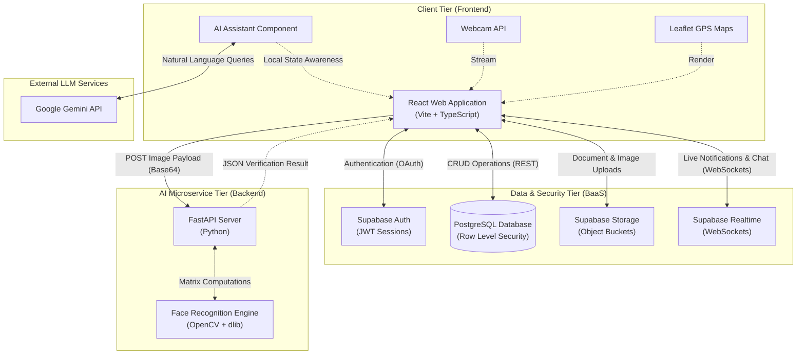
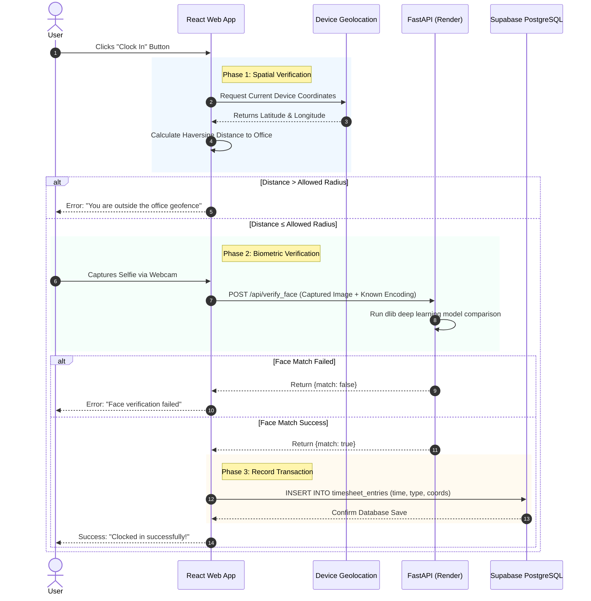
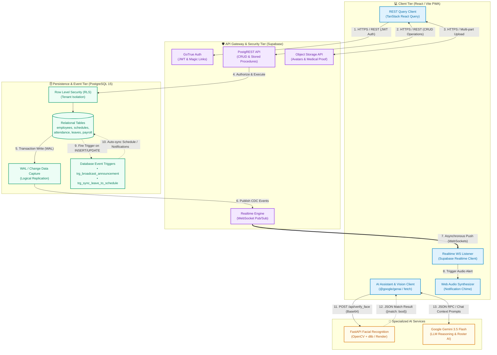

# System Architecture Document
**Project: Smart Workforce Management System**

This document outlines the high-level architecture, component interactions, and data flow of the system. The diagrams and explanations below are designed to be included in your Capstone documentation (e.g., Chapter 3: System Design & Architecture).

---

## 1. High-Level System Architecture

The system follows a modern **Service-Oriented Architecture (SOA)**, separating the presentation layer, the data/auth layer, and the heavy computational AI layers into distinct, decoupled services.

### Tier Breakdown:
1. **Client Tier (Vercel):** The user-facing React application. It handles routing, UI state, form validation, capturing webcam data, rendering live interactive Maps (Leaflet), and managing the context-aware Gemini AI chat assistant.
2. **Data & Security Tier (Supabase):** The central hub for persistent state and real-time connectivity. It utilizes PostgreSQL with strict Row-Level Security (RLS) policies. It also leverages Supabase Realtime (WebSockets) for instantaneous notifications and in-app messaging, alongside Storage buckets for document hosting.
3. **AI Microservice Tier (Render):** A stateless Python application designed specifically to handle heavy C++ matrix computations required for facial recognition. It is completely isolated from the database to ensure the frontend remains highly performant and scalable.
4. **External LLM Services:** Integration with Google's Gemini API to power the conversational AI Assistant, enabling dynamic querying of HR data and automated schedule health-checks.

---

## 2. Core Data Flow: The Attendance Clock-In Process

The most complex interaction in the system is the biometrically-secured, GPS-restricted clock-in process. This sequence diagram illustrates the exact chronological flow of data between the user, the frontend, the AI server, and the database.

### Clock-Out Anomaly Detection
When a user attempts to **Clock Out**, the system executes a reverse validation flow that calculates the travel velocity between the original clock-in coordinates and the current clock-out coordinates. If the speed implies impossible travel (e.g., >800 km/h), the record is immediately flagged in the database to prevent GPS spoofing fraud.

---

## 3. Security & Access Architecture

To satisfy enterprise security requirements, the application implements a defense-in-depth approach:

1. **Edge Security:** The frontend is served via Vercel's global CDN, ensuring encrypted HTTPS transit and DDoS protection.
2. **Authentication Security:** Users receive a cryptographically signed JSON Web Token (JWT) upon login via Supabase Auth.
3. **Database Security (RLS):** Before executing any SQL query, PostgreSQL evaluates the JWT. 
   - *Example:* The policy `select_timesheet_org` ensures that a Manager can only query timesheet rows belonging to employees within their specific `org_id`.
4. **Fraud Prevention AI:** Real-time spatial verification (Impossible Travel calculation) and computer-vision based Liveness checks prevent proxy attendance (buddy punching).
5. **Storage Security:** The `leave_attachments` bucket is strictly configured to prevent public file listing, ensuring medical documents remain confidential and only accessible via authenticated, explicit file-path requests.

---

## 4. System Communication Patterns

The architecture coordinates multiple communication styles across client, server, database, and AI microservices:

### Communication Flow Summary

1. **Synchronous REST / HTTPS (Request-Response):**
   - The React frontend communicates with the **Supabase PostgREST API** for structured CRUD data operations, passing JWT session headers evaluated against PostgreSQL Row-Level Security (RLS).
   - Medical documents and employee avatars are uploaded directly to **Supabase Object Storage** over HTTPS.

2. **Asynchronous Real-Time (WebSockets / Pub-Sub):**
   - When database records change, PostgreSQL logical replication generates **Write-Ahead Log (WAL) Change Data Capture (CDC)** events.
   - The **Supabase Realtime Engine** publishes these events to subscribed client channels via WebSockets (`wss://`), immediately updating the live Attendance Map radar, unread notification counters, and triggering the in-browser Web Audio synthesized chime.

3. **In-Database Event-Driven Triggers:**
   - PostgreSQL triggers (`trg_broadcast_announcement`, `trg_sync_leave_to_schedule`) automate database-level workflows synchronously within transactions to guarantee ACID integrity.

4. **Dedicated AI Microservice & LLM Inferences:**
   - **Facial Biometrics:** Front-end webcam captures are transmitted as Base64 image payloads to the Python FastAPI microservice on Render for OpenCV + `dlib` 128D metric matching.
   - **Gemini AI Intelligence:** Conversational prompts and roster metrics are sent via Google Gemini 3.5 API for AI-assisted scheduling, leave evaluations, and labor compliance audits.

