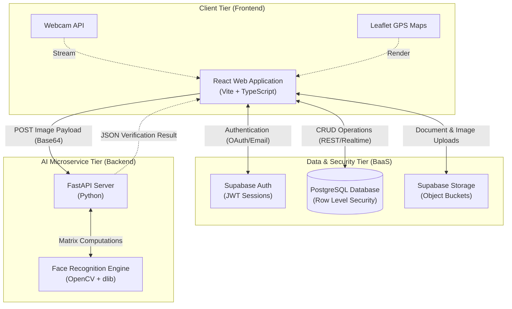
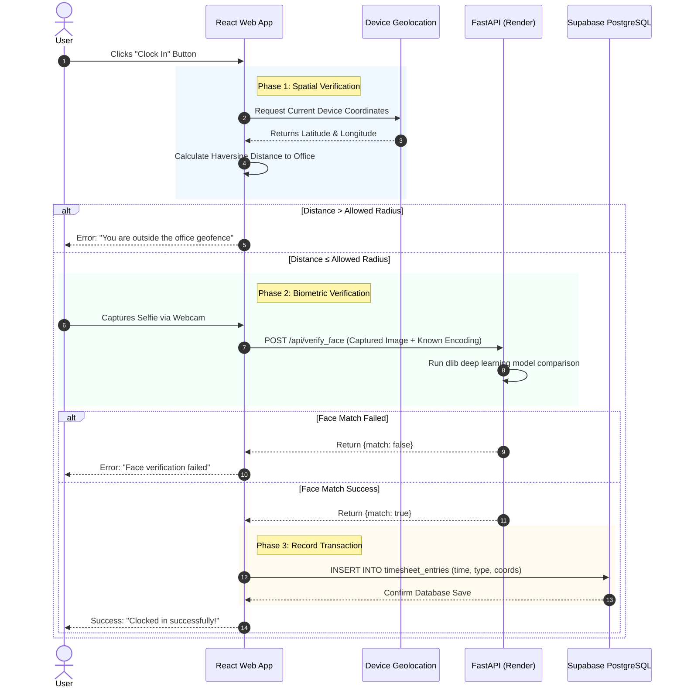

# System Architecture Document
**Project: Smart Workforce Management System**

This document outlines the high-level architecture, component interactions, and data flow of the system. The diagrams and explanations below are designed to be included in your Capstone documentation (e.g., Chapter 3: System Design & Architecture).

---

## 1. High-Level System Architecture

The system follows a modern **Three-Tier Service-Oriented Architecture (SOA)**, separating the presentation layer, the data/auth layer, and the heavy computational AI layer into distinct, decoupled services.

### Tier Breakdown:
1. **Client Tier (Vercel):** The user-facing React application. It handles routing, UI state, form validation, capturing webcam data, and querying the browser's Geolocation API.
2. **Data & Security Tier (Supabase):** The central hub for persistent state. It utilizes PostgreSQL with strict Row-Level Security (RLS) policies to ensure that users (Employees vs. HR) can only read/write data permitted by their cryptographic JWT role.
3. **AI Microservice Tier (Render):** A stateless Python application designed specifically to handle heavy C++ matrix computations required for facial recognition. It is completely isolated from the database to ensure the frontend remains highly performant and scalable.

---

## 2. Core Data Flow: The Attendance Clock-In Process

The most complex interaction in the system is the biometrically-secured, GPS-restricted clock-in process. This sequence diagram illustrates the exact chronological flow of data between the user, the frontend, the AI server, and the database.

---

## 3. Security & Access Architecture

To satisfy enterprise security requirements, the application implements a defense-in-depth approach:

1. **Edge Security:** The frontend is served via Vercel's global CDN, ensuring encrypted HTTPS transit and DDoS protection.
2. **Authentication Security:** Users receive a cryptographically signed JSON Web Token (JWT) upon login via Supabase Auth.
3. **Database Security (RLS):** Before executing any SQL query, PostgreSQL evaluates the JWT. 
   - *Example:* The policy `select_timesheet_org` ensures that a Manager can only query timesheet rows belonging to employees within their specific `org_id`.
4. **Storage Security:** The `leave_attachments` bucket is strictly configured to prevent public file listing, ensuring medical documents remain confidential and only accessible via authenticated, explicit file-path requests.
